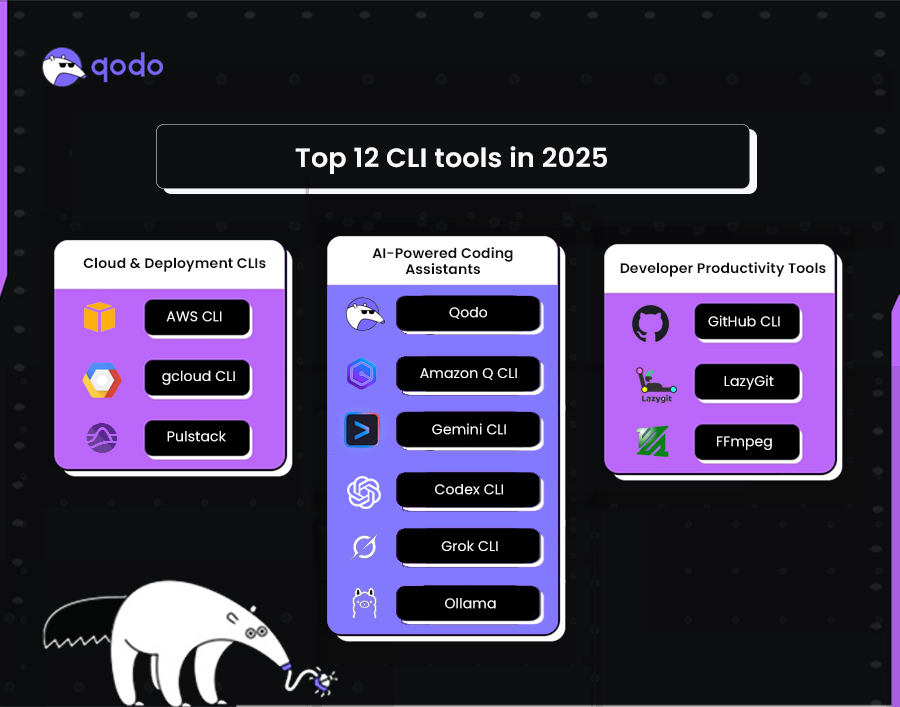

# 🚀 Modern CLI Tools Overview (2025)

This document gives a complete overview of **modern CLI (Command-Line Interface) tools** — their purpose, active development trends, major AI model CLIs, and company adoption insights.

---

## 📘 1. What Are CLI Tools?

**CLI (Command-Line Interface) tools** allow users to interact with software directly from the terminal.  
They help automate workflows, manage systems, and integrate AI into developer pipelines.

Modern CLIs now combine **traditional DevOps control** with **AI-powered automation**, enabling natural-language coding, code generation, testing, and cloud management — all from your terminal.

---

## ⚙️ 2. Modern Uses of CLIs (Today’s Workflows)

| Use Case | Description |
|-----------|-------------|
| 🧠 **AI-Powered Coding** | CLIs like Gemini, Codex, Claude, and Qwen can write or refactor code using AI models. |
| ☁️ **Cloud & Infrastructure Automation** | Tools like `aws`, `gcloud`, and `pulumi` manage servers, databases, and deployments. |
| 💡 **Developer Productivity** | CLIs simplify Git operations, test automation, and code review tasks. |
| 🧩 **Agentic AI Integration** | Modern CLIs embed AI agents that understand repos and take actions. |

---

## 🤖 3. “Vibe Coding” (AI-Assisted / Wipe Coding)

**Vibe coding** means coding through *intent*, not syntax — developers describe what they want in plain English, and AI tools generate or modify the code automatically.

It represents the **next generation of CLI work**:
- Fast AI-driven refactoring.
- Code understanding and documentation.
- Automated test generation.
- Continuous AI assistance during development.

---

## 🧩 4. Top Model-Based CLI Tools (2025)

| Tool | Developer | Description | GitHub Stars* | Strength |
|------|------------|--------------|----------------|-----------|
| **Gemini CLI** | Google | Open-source CLI for running Gemini models in the terminal. | ~81.4k | Excellent for AI workflows & agent extensions. |
| **Codex CLI** | OpenAI | Lightweight coding agent CLI for AI-assisted programming. | ~49.7k | Best for OpenAI ecosystem & editor integrations. |
| **Claude Code CLI** | Anthropic | Secure, enterprise-grade AI coding assistant for terminal use. | ~41.3k | Great for safe, enterprise environments. |
| **Qwen Code CLI** | Alibaba (QwenLM) | CLI for Qwen3-Coder models, supports multilingual coding. | ~15k | Optimized for Asian and multilingual developers. |

> ⭐ *Star counts are approximate (as of November 2025).

---

## 📊 5. Popular Aggregator Repositories (For Data & Research)

| Repository | Description | Link |
|-------------|-------------|------|
| **agarrharr/awesome-cli-apps** | The largest curated list of CLI apps across all domains. | [GitHub Link](https://github.com/agarrharr/awesome-cli-apps) |
| **toolleeo/awesome-cli-apps-in-a-csv** | CSV version of the above for data analysis and filtering. | [GitHub Link](https://github.com/toolleeo/awesome-cli-apps-in-a-csv) |
| **ConardLi/easy-llm-cli** | A multi-model CLI supporting OpenAI, Gemini, and others. | [GitHub Link](https://github.com/ConardLi/easy-llm-cli) |

These repositories are excellent starting points if you want **all CLI data in one place** (README or CSV format).

---

## 🧠 6. CLI-Lite (Lightweight CLI Tools)

“CLI-Lite” tools are **small, fast, and single-purpose** terminal apps.  
They are commonly used for:
- Quick automation
- File management
- API interaction
- AI chat & translation in terminal

There are **1000+** CLI-Lite or minimalistic CLI projects listed on GitHub under various “awesome” lists.

---

## 🏢 7. Companies Developing or Using CLI Tools

| Company | CLI Tool / Project | Area of Focus |
|----------|--------------------|----------------|
| **Google** | Gemini CLI | AI workflows & data analysis |
| **OpenAI** | Codex CLI | Coding agent and automation |
| **Anthropic** | Claude Code | Safe, agentic AI programming |
| **Alibaba Cloud** | Qwen Code | Multilingual and enterprise coding |
| **AWS / GitHub / GCP** | Native CLIs | Cloud & DevOps management |

---

## 💰 8. Market Value & Popularity Snapshot

| Tool | Key Market Advantage | Adoption Type |
|------|----------------------|----------------|
| **Gemini CLI** | Most community visibility and integration support | Open-source & Enterprise |
| **Claude Code** | Enterprise trust, safety-first model | Commercial |
| **Codex CLI** | Large developer community via OpenAI API | Open-source & Developer |
| **Qwen Code** | Regional adoption & multilingual strength | Academic & Enterprise |

> **Insight:** AI-driven CLIs are rapidly expanding into both open-source and enterprise domains.  
> Gemini CLI currently leads in visibility and community engagement.

---

## 📚 9. Further Reading

- [Qodo Blog – 12 CLI Tools Redefining Developer Workflows](https://www.qodo.ai/blog/best-cli-tools/)
- [Google Gemini CLI GitHub](https://github.com/google-gemini/gemini-cli)
- [OpenAI Codex CLI GitHub](https://github.com/openai/codex)
- [Anthropic Claude Code GitHub](https://github.com/anthropics/claude-code)
- [Alibaba Qwen Code GitHub](https://github.com/QwenLM/qwen-code)

---

## 🧾 10. Summary

Modern CLI tools are evolving from **simple text interfaces** into **intelligent developer companions**.  
They automate repetitive work, enable natural-language coding, and integrate with cloud, Git, and AI systems.

> 💡 The future of CLI development is **AI-first**, **multimodal**, and **cross-platform**, making the terminal the smartest workspace for developers.

---

### 🏁 Author Notes
This README was compiled from verified open-source repositories, AI company documentation, and the Qodo blog (2025).
