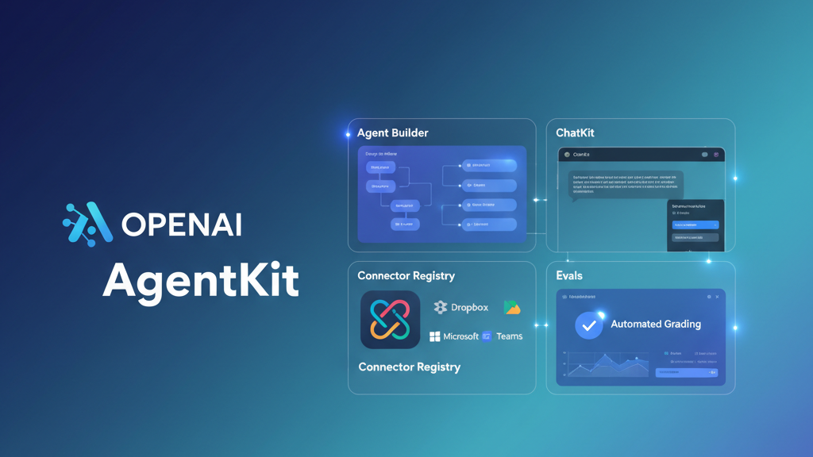
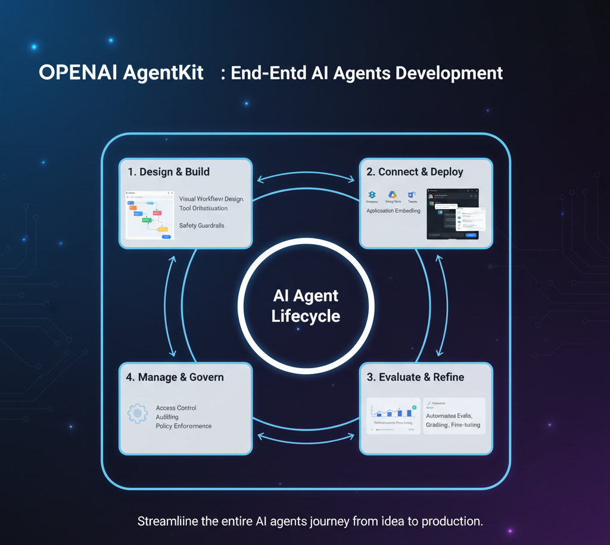
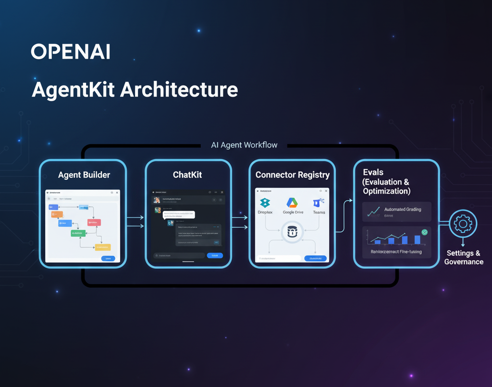

<!-- Header Banner -->

  

<h1 align="center">🚀 OpenAI AgentKit (2025)</h1>

  <b>The Complete Introduction and Overview</b> 
  Launched by OpenAI — October 2025

  
  
  
  

---

## 🧠 Introduction

**AgentKit** is OpenAI’s latest technology, launched in **October 2025**, designed to help developers **build, deploy, evaluate, and optimize AI agents** with less effort and more safety.

It combines multiple tools—**Agent Builder**, **ChatKit**, **Connector Registry**, **Evals**, and **Guardrails**—into one unified ecosystem for faster, safer AI agent creation.

> 💡 *Think of AgentKit as the "VS Code" for AI agents — everything you need to design, debug, test, and launch in one place.*

---

## 🧩 What is AgentKit?

AgentKit is a **developer toolkit** that streamlines the full lifecycle of AI agents.  
It works closely with OpenAI’s **Responses API** and **Agent SDK**, giving both visual designers and coders powerful tools for agent creation.

### Key Capabilities
- Visual drag-and-drop **Agent Builder**
- Plug-and-play **ChatKit** chat UI toolkit
- Central **Connector Registry** for APIs and data
- Built-in **evaluation and guardrails**
- Optional **Reinforcement Fine-Tuning (RFT)** for continuous learning

  

---

## ⚙️ Main Components

| Component | Description |
|------------|-------------|
| **Agent Builder** | Visual canvas to design multi-agent workflows and logic using drag-and-drop. |
| **ChatKit** | Pre-built chat UI components for embedding conversational agents in apps. |
| **Connector Registry** | Central management for data and tool connections with permission controls. |
| **Evals** | Enhanced evaluation and grading system for AI agent performance. |
| **Guardrails** | Ensures privacy, compliance, and safety across all agent responses. |
| **Reinforcement Fine-Tuning (RFT)** | Method to improve agent behavior based on feedback. |

---

## 🌍 Why AgentKit Matters

### ✅ Simplifies AI Development
All essential tools—UI, logic, evaluation, and safety—come under one system.

### 🔒 Safety and Reliability
**Guardrails** prevent unsafe or biased outputs and protect sensitive data.

### ⚡ Faster Iteration
Early adopters like **Ramp** and **LY Corporation** built agents in hours instead of weeks.

### 🤝 Team Collaboration
Visual and code tools enable engineers, designers, and managers to work together seamlessly.

### 📊 Measurable Improvement
Trace grading and versioning allow real-time monitoring and optimization.

---

## 💰 Availability & Pricing

| Feature | Status | Pricing Model |
|----------|---------|----------------|
| **ChatKit** | Available | Standard OpenAI API usage |
| **Evals (for Agents)** | Available | Included |
| **Agent Builder** | Beta (rolling out) | Included |
| **Connector Registry** | Beta (Enterprise/Education) | Included with org plans |
| **Reinforcement Fine-Tuning (RFT)** | Available (o4-mini) / GPT-5 Beta | Usage-based |
| **Guardrails** | Available | Included |

> 💡 *There is no separate license fee for AgentKit — only standard API costs apply.*

---

## 🏗️ Example Architecture

  

---

## 🧭 Use Cases

- **Customer Support Agents** that interact with company knowledge bases.  
- **Research and Data Agents** that find, summarize, and reference content.  
- **Automation Agents** that connect APIs and business workflows.  
- **Educational Tutors** that provide adaptive learning and grading.  
- **Enterprise Assistants** with safety and compliance built-in.

---

## 🧱 Key Benefits

| Benefit | Description |
|----------|-------------|
| **Unified Platform** | Build, test, and deploy in one environment. |
| **Safety First** | Guardrails and evaluation are built-in. |
| **Fast Prototyping** | Create agents in hours, not weeks. |
| **Enterprise Ready** | Secure integrations and governance support. |
| **Visual + Code Friendly** | Balance between low-code and full developer control. |

---

## 🧩 Early Access Partners

- **Ramp** — Automated finance and reimbursement agents.  
- **LY Corporation** — Business collaboration agents.  
- **Education Platforms** — AI tutors and grading agents.

These partners reported **3–5x faster deployment** and improved reliability.

---

## 🧾 Conclusion

OpenAI’s **AgentKit** is a powerful step toward making **AI agents easier, safer, and faster to develop**.  
By combining design tools, evaluations, and safety mechanisms, it gives developers and organizations a unified workflow to bring AI into production confidently.

> **In short:**  
> **AgentKit = One Platform for Building Smarter, Safer, and Faster AI Agents**

---

**Author:** Malik Saad Khawar  
**Last Updated:** October 2025  
**Source:** [OpenAI Blog — Introducing AgentKit](https://openai.com/index/introducing-agentkit)
